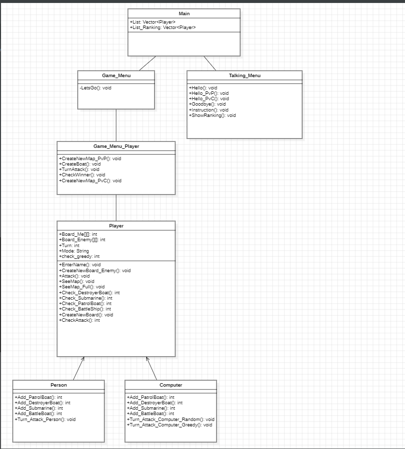
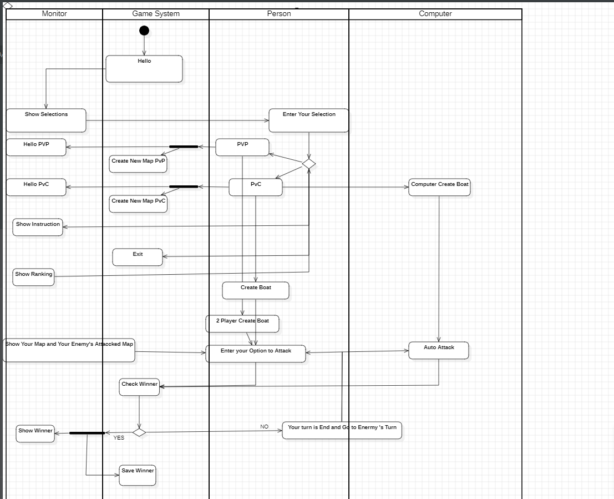
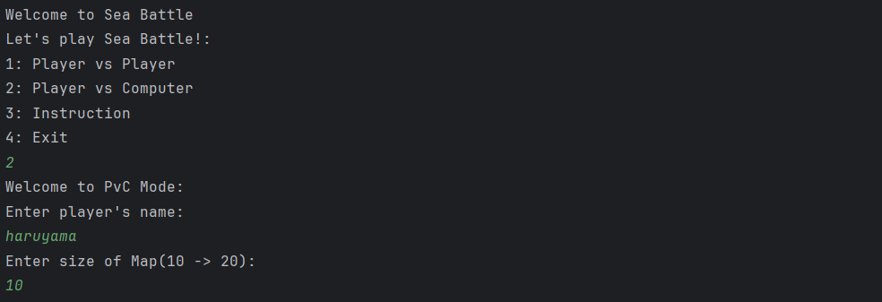
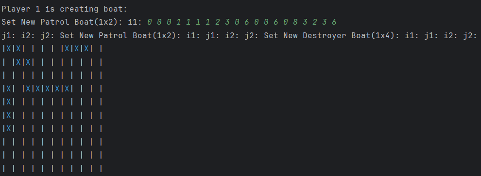
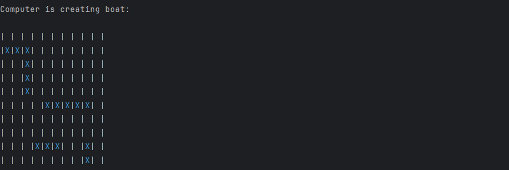
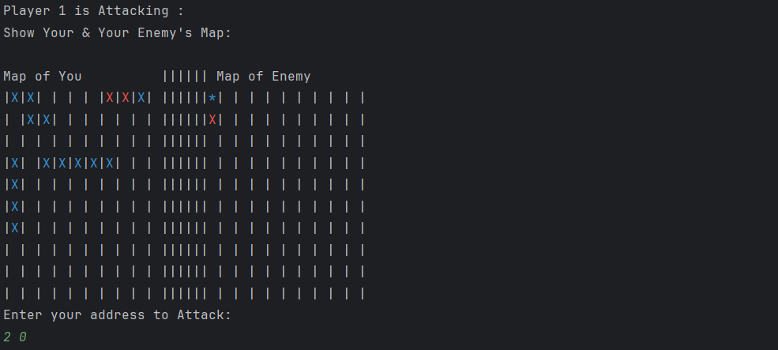
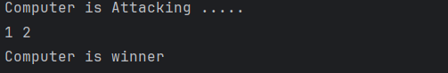

# Sea Battle

Sea Battle is a game for two players. The game is played on two grids, one for each player. The grids are typically square – usually 10×10. In first turn, player place their battleship then the opponent does. Then in each turn, player can choose a square on their opponent grid then attack it. In a turn, players do not see where their opponent's ships are placed.

## (UML)
Class_Diagrams:

Activity_Diagrams:


## Demo Video

https://youtu.be/WiqDej9jEnk

## Image








## Features

- Player can play with computer
- Player can play with another player
- Player can choose game mode
- Player can choose size of map

## Usage

- Project Structure

```bash
src
│
├── Main
├── Game Menu
├── Game_Menu_Player
├── Player
├── Person
├── Computer
├── Talking_Menu
```
